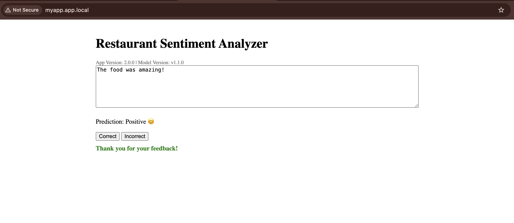

# Table of Contents

- [Use Case](#use-case)
  - [Overview](#overview)
  - [Screenshots](#screenshots)
- [Design Documentation](#design-documentation)
- [How to Run](#how-to-run)
  - [Manual Kubernetes Access](#manual-kubernetes-access)
  - [Helm Charts](#helm-charts)
- [Canary and Label-Based Routing with Istio](#canary-and-label-based-routing-with-istio)
  - [Frontend Canary Testing (Thumbs UI vs. Text Buttons)](#frontend-canary-testing-thumbs-ui-vs-text-buttons)
  - [Backend Version Control with `label` header](#backend-version-control-with-label-header)
  - [Sticky Sessions with Consistent Hashing on Custom Headers](#sticky-sessions-with-consistent-hashing-on-custom-headers)
- [Monitoring](#monitoring)
  - [Prometheus](#prometheus)
  - [Alerts](#alerts)
- [Grafana Dashboard](#grafana-dashboard)
- [Docker Compose Setup](#docker-compose-setup)
- [Provisioning Setup](#provisioning-setup)
- [Development](#development)
- [API Documentation](#api-documentation)

# Use Case: Restaurant Sentiment Analysis



Our application features a simple interface where users can enter text about a
restaurant experience to analyze its sentiment. As they type, text analysis
happens in real-time, showing the predicted sentiment instantly. This analysis
is done by a sentiment analysis model on the backend, which is handled by a
dedicated service. The user then sees whether the text is positive or negative,
and their feedback helps us analyze the performance of the model to
continuously improve it over time.

---

# Design Documentation

You can find our deployment documentation at [`docs/deployment.md`](docs/deployment.md).

Documentation for continuous experimentation is also located in [`docs/deployment.md`](docs/deployment.md).

The extension proposal is documented at [`docs/extension.md`](docs/extension.md).

---

# How to Run

> :warning: **SSH Setup Required:** Please generate and configure your SSH keys
> before attempting to provision. Instructions are available in the
> [`provisioning/`](https://github.com/remla25-team15/operation/tree/main/provisioning)
> README.

To provision, orchestrate, and deploy the application using Kubernetes:

```bash
./scripts/run-all.sh
```

The application will be accessible at [http://myapp.app.local/](http://myapp.app.local/).

The script will wait for pods and services to become available and is safe to re-run if it times out:

```bash
./scripts/run-all.sh --provision
```

Provisioning is mostly idempotent and will resume as needed. Models are
downloaded and cached in `provisioning/shared/`, improving subsequent runs.

> :coffee: First run may take a while. Grab a coffee!

If you're running it for the first time, the model-service will download the
models to cache them locally in a shared folder `provisioning/shared/` which is
shared across all VMs and mounted in the container. This is persistent so
subsequent invocations will use this rather than downloading the model again
whenever the container is re-created.

> :warning: **DNS Entries:** Ensure your `/etc/hosts` contains entries like:
>
> ```
> 192.168.56.80 myapp.app.local kiali.local prometheus.local grafana.local
> 192.168.56.81 dashboard.local
> ```
>
> These should be added automatically by `scripts/update-hosts.sh`. If not, add them manually.

> :warning: Bash required: Scripts are written in Bash/Zsh. On Windows, use Git Bash.

---

## Manual Kubernetes Access

To manage Kubernetes from your host:

```bash
export KUBECONFIG=$(pwd)/provisioning/kubeconfig
```

First, for managing kubernetes cluster from the host machine and running any `kubectl` commands,
you need to set the `KUBECONFIG` variable to point to the configuration.

> You need to make sure to set this variable for every shell invocation, i.e. whenever you open a new shell, please make sure to set this
> before you try to run `kubectl`.

---

## Helm Charts

Enable Istio sidecar injection:

```bash
kubectl label ns default istio-injection=enabled
```

The helm charts are separated into monitoring charts and application charts.
This allows us to create multiple releases of the same application while avoiding duplication of the monitoring tools.

Install charts:

```bash
helm install monitoring ./helm/monitoring-chart
helm install myapp ./helm/app-chart
```

List and check chart status:

```bash
helm list
helm status <chart-name>
```

To test multiple releases, install another app instance and update `/etc/hosts` accordingly.

> Note: If you wish to test multiple releases, you can do so by running the `helm install <app-name> ./helm/app-chart` but
> then you need to update the /etc/hosts file with the name (`<app-name>`) of the new release, e.g. myapp2.app.local on the same line as myapp.app.local

---

# Canary and Label-Based Routing with Istio

This deployment demonstrates Istio’s advanced routing capabilities with two
mechanisms:

1. **Frontend Canary Release** using the `user-group` header
2. **Backend Version Targeting** using the `label` header for `app-service` and
   `model-service`

---

## Frontend Canary Testing (Thumbs UI vs. Text Buttons)

Users with the `user-group: canary` header are always routed to the new version
(v2) of the frontend, which displays thumbs up/down icons instead of
traditional buttons. Others receive the standard version (v1).

```zsh
❯ curl -s -H "user-group: canary" app.local | grep -A18 "Prediction"
      <p>Prediction: <span id="prediction">-</span></p>
      <div class="feedback-buttons">
        
        
      </div>

      <div id="feedback-message"></div>
    </div>
```

While the main release has buttons:

```zsh
❯ curl -s app.local | grep -A5 "Prediction"
      <p>Prediction: <span id="prediction">-</span></p>
      <button onclick="sendFeedback(true)">Correct</button>
      <button onclick="sendFeedback(false)">Incorrect</button>
      <div id="feedback-message"></div>
    </div>
```

---

## Backend Version Control with `label` Header

The `label` header controls routing for both `app-service` and `model-service`.
This ensures consistent backend behavior per request.

```zsh

# Route explicitly to v1 versions curl -H "label: v1"
❯ curl -H "label: v1" app.local/app/api/version

# Route explicitly to v2 versions curl -H "label: v2" app.local/app/api/version
❯ curl -H "label: v2" app.local/app/api/version
```

If no `label` is provided, traffic is split 50/50 between v1 and v2 for both
services.

### Consistency Guarantee

Using headers for routing ensures users consistently interact with the correct
version of both frontend and backend services during testing, canary rollout,
or A/B experiments.

## Sticky Sessions with Consistent Hashing on Custom Headers

To ensure users maintain a consistent experience during canary or A/B tests,
Istio's load balancer uses consistent hashing on a custom header `x-user`.
This means requests from the same user (identified by the header value) are
routed to the same service version throughout their session.

You can test sticky sessions by repeatedly sending requests with the same
header:

```zsh
count=0; while [ $count -lt 8 ]; do
  curl -s -H "x-user: bob" http://app.local | grep -A5 "Prediction"
  ((count++))
done
```

# Monitoring

## Prometheus

To access Prometheus UI and Query metrics you can port forward from a new terminal in `./operation`:

```zsh
./scripts/update-hosts.sh
kubectl port-forward -n monitoring svc/myprom-kube-prometheus-sta-prometheus 9090
```

Then go to [http://localhost:9090](http://localhost:9090).
It is possible to query:

### Available Metrics

| Metric Name                                 | Description                                            | Labels                                              |
| ------------------------------------------- | ------------------------------------------------------ | --------------------------------------------------- |
| `frontend_prediction_requests_total`        | Total number of prediction requests sent from frontend | `status` (e.g. `200`, `500`)                        |
| `frontend_active_users_total`               | Current number of active users                         | `device_type` (e.g. `desktop`, `mobile`)            |
| `frontend_predict_request_duration_seconds` | Histogram of latencies for `/api/predict` requests     | —                                                   |
| `frontend_feedback_rating_total`            | Number of feedback ratings classified by type          | `feedback_type` (`positive`, `negative`, `unknown`) |

The metrics are also accessible at [http://app.local/metrics](http://app.local/metrics).

### Alerts

In the application we have a custom PrometheusRule - `TooManyActiveUsers` located in `helm/myapp-chart/prometheus/custom_alert_rules.yml`.
It triggers once we have more than `threshold` active users, currently it is 15 but can be changed in helm values.

To receive an email notification you need to create a secret with your credentials after application start up.
You can run:

```bash
kubectl create secret generic alertmanager-smtp-secret \
  --from-literal=smtp_username=fake-user@example.com \
  --from-literal=smtp_password=fake-password \
  -n monitoring
```

After this you need to upgrade your releases, so run:

```bash
helm upgrade --install myapp helm/app-chart/ -f helm/app-chart/values.yaml
helm upgrade --install monitoring helm/monitoring-chart/ -f helm/monitoring-chart/values.yaml
helm upgrade --install myprom prometheus-community/kube-prometheus-stack -n monitoring -f helm/app-chart/values.yaml
kubectl delete pod -n monitoring alertmanager-myprom-kube-prometheus-sta-alertmanager-0
```

To check that your credentials were correctly injected into alert manager you can run:

```bash
kubectl exec -n monitoring -it alertmanager-myprom-kube-prometheus-sta-alertmanager-0 -- cat /etc/alertmanager/config_out/alertmanager.env.yaml
```

Replace `alertmanager-myprom-kube-prometheus-sta-alertmanager-0` with the name of your alert manager pod.

## Grafana Dashboard

To access the dashboard go to: Grafana URL: http://grafana.local/ (Credentials: admin / admin). After you ran the steps from [the setup](#How-to-run?)

The dashboard is automatically installed in Grafana using a Kubernetes ConfigMap and Helm chart. No manual import is required.

How it works:

- The dashboard JSON is stored at `operation/helm/myapp-chart/grafana/grafana-dashboard.json`.
- The Helm chart includes a ConfigMap (`templates/grafana/configMap.yml`) that mounts this dashboard into the Grafana pod.
- The deployment mounts the ConfigMap and uses a provisioning config (`provisioning-configMap.yml`) so Grafana loads dashboards from the correct path.
- When you deploy the Helm chart (e.g., with `./scripts/run-all.sh`), the dashboard appears automatically in Grafana.

### Updating the dashboard

To update the Grafana dashboard, replace the JSON file at `operation/helm/myapp-chart/grafana/grafana-dashboard.json` with your new or modified dashboard JSON. You can find dashboards on the [Grafana Dashboard Marketplace](https://grafana.com/grafana/dashboards/) or create your own using [these instructions](https://grafana.com/docs/grafana/latest/dashboards/build-dashboards/). After updating the JSON, redeploy the Helm chart to apply changes. You can use default Prometheus metrics or the [custom metrics listed above](#available-metrics).

---

# Docker Compose Setup

From `operation/`:

```bash
cd operation
docker compose -f docker-compose.yml up -d
```

App will be available at [http://localhost:8080](http://localhost:8080).

---

# Provisioning Setup

> SSH must be correctly configured. See [`provisioning/`](https://github.com/remla25-team15/operation/tree/main/provisioning)

```bash
./scripts/run-provisioning.sh
```

This script runs all necessary vagrant commands and then proceeds to provision the VMs.

After provisioning is successful, you need to add the kubernetes dashboard IP to your `/etc/hosts` so we can access it locally.
To do this, you can run:

```bash
./scripts/update-hosts.sh
```

Access dashboard at: [https://dashboard.local/](https://dashboard.local/)

Generate access token:

```bash
kubectl -n kubernetes-dashboard create token admin-user
```

---

# Development

## API Documentation

Docs are available at:

- app-service: [http://myapp.myapp.app.local/app/apidocs/](http://myapp.app.local/app/apidocs/)
- model-service: [http://myapp.app.local/model/apidocs/](http://myapp.app.local/model/apidocs/)

### Expected Directory Structure

```zsh
.
├── operation/                # Entry point with docker-compose files
│   ├── docker-compose.yml
│   └── docker-compose.override.yml (used in development)
├── app-frontend/            # Frontend (UI)
├── app-service/             # Flask Backend API
├── lib-ml/                  # Shared ML utilities
├── lib-version/             # Versioning logic
├── model-service/           # Model loading/inference logic
└── model-training/          # Model training pipeline
```

All sibling directories are mounted or built as needed from the `operation/` context.

Clone:

```bash
./clone.sh
```

For local development, use the `docker-compose.override.yml` file. This override:

- Builds images for the services locally
- Mounts local directories as volumes for live code updates
- Sets development environment variables

Run in development mode:

```bash
cd operation
docker compose up --build
```

Access: [http://localhost:8080](http://localhost:8080)

### Clean-up

```bash
docker compose down
docker compose logs -f
```

---
