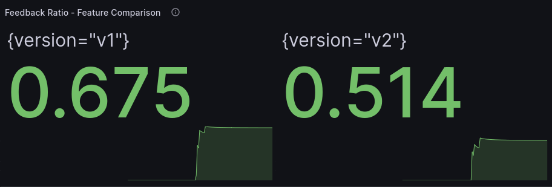
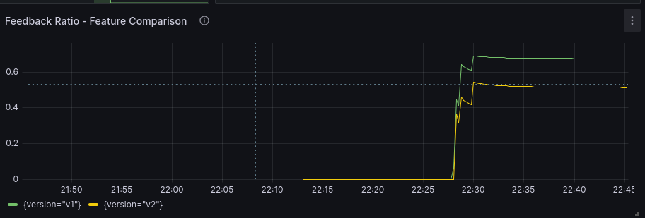

# Continuous Experimentation

## Overview

This document describes the continuous experimentation process used to evaluate a new feature introduced in the frontend of our sentiment analysis web application. The goal is to determine whether the new feature improves user button usage.

## Experimental Feature

**Feature:** Feedback icons (👍 / 👎) are added instead of "Correct" and "Incorrect" buttons in the sentiment analysis web application.

**Feature Branch:** `experiment-feature-ui-icons`  
**Tag format:** `vX.Y.Z-feature-feedback-icons`

**Base Version (Control):** `main` branch  
**Tag format:** `vX.Y.Z`

The feature was deployed as a separate version of the front-end application, allowing us to compare user interaction rate between the base version and the experimental version in A/B testing. 

## Hypothesis

> **H_0 (Null Hypothesis):** The addition of feedback icons does not change the percentage of user feedback interactions per prediction request compared to the base version.
>
> **H_1 (Alternative Hypothesis):** The version with feedback icons will have a higher percentage of user feedback interactions per prediction request compared to the base version.

## Metrics

To falsify the hypothesis, look at following metrics scraped by Prometheus:

| Metric Name                     | Description                                             |
|---------------------------------|---------------------------------------------------------|
| `prediction_requests_total`     | Counter for prediction requests made by users           |
| `feedback_rating_total`         | Counter for feedback events (positive or negative)      |

### Feedback Ratio
The primary metric used to evaluate impact is the feedback-to-request ratio:
```
sum(increase(frontend_feedback_rating_total[1d])) by (version)
/
sum(increase(frontend_prediction_requests_total[1d])) by (version)
```

This ratio represents the fraction of prediction requests that resulted in user feedback. The window is chosen to be 1 day but in real deployment would probably be a longer time.

## Deployment Setup

The traffic is split evenly between the base and feature versions **50/50**. Traffic is managed by Istio’s traffic routing./
Feature version is called - `v1`\
Base versoin is called - `v2`

## Results
The results from Grafana Dashboard:



### Decision
Since we did not deploy the application or conduct an independent study with participants, the data was mocked, hence we simply adopted the feature.\
In real deployment scenario the following steps would be taken when deciding whether to adopt the new feature:
 - Use statistical tests to determine whether differences in feedback rates are significant.
 - Predefine what constitutes a meaningful improvement (e.g., a statistically significant ≥10% increase in feedback interaction rate).
 - If the experimental version shows improvement, gradually roll it out to a larger user base, monitoring for regressions or unexpected behavior.
 - Fully adopt the feature if it consistently improves engagement.