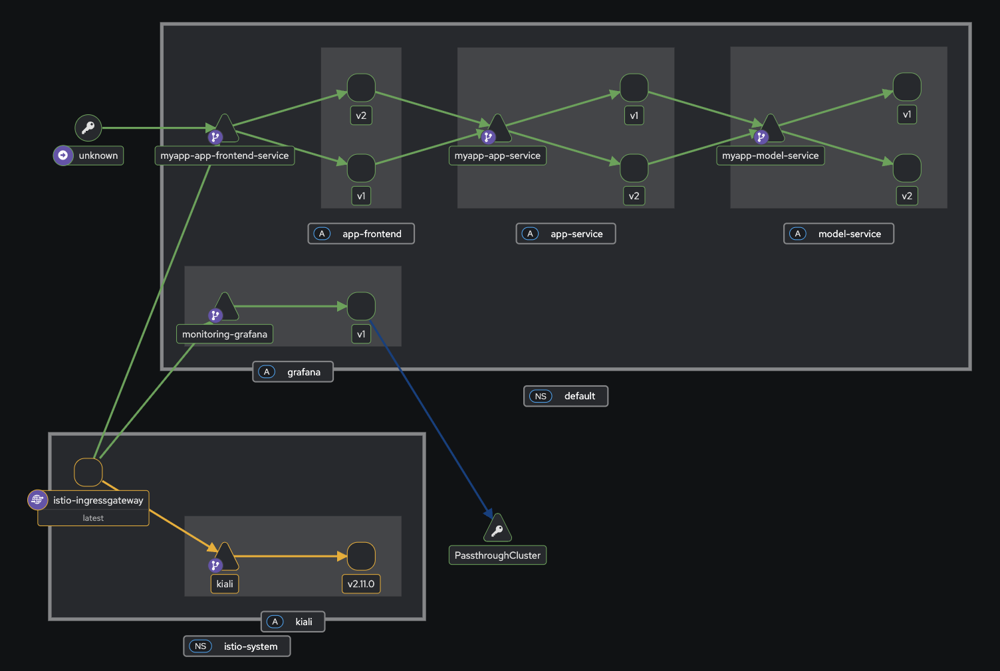

# Deployment overview

This document outlines the deployment structure and request flow of our
application. It is designed to help new contributors understand the overall
architecture, the services involved, and how traffic is managed and observed
using Istio.

## Cluster Setup Overview

Our current Kubernetes cluster consists of one controller VM (forming the control
plane) and two worker node VMs (forming the data plane). The environment is
provisioned using Vagrant and Ansible for local infrastructure automation.

> These nodes are configured and provisioned in `provisioning/` folder and can be easily scaled up by updating
> the variables provided in the Vagrantfile

- The controller node runs core Kubernetes control plane components

- The worker nodes host all application and monitoring workloads, including our
  microservices (`app-frontend`, `app-service`, `model-service`) and observability
  tools (`grafana`, `prometheus`, `kiali`).

Each Pod deployed to the worker nodes has an Istio sidecar proxy
([Envoy](https://istio.io/latest/docs/ops/deployment/architecture/#envoy))
automatically injected. These sidecars form the service mesh data plane,
enabling secure and observable communication between services.

All nodes are connected via the Kubernetes cluster network, enabling seamless
pod-to-pod and service-to-service communication across the cluster.

# Deployment architecture

Our deployment is organized as a Helm chart and includes several templates for the
microservices, monitoring components, and service mesh infrastructure. All components are
deployed to a Kubernetes cluster and interact over a service mesh provided by
Istio.

# Component Overview

| Component       | Description                                                            |
| --------------- | ---------------------------------------------------------------------- |
| `app-frontend`  | The frontend UI exposed via Istio Gateway                              |
| `app-service`   | A backend microservice for communication between app and model-service |
| `model-service` | A model-serving component that handles ML inference                    |
| `grafana`       | Metrics dashboard                                                      |
| `prometheus`    | Metrics collection, integrated with Istio and Grafana                  |
| `istio`         | Manages traffic routing and mesh policy                                |
| `kiali`         | Istio observability dashboard, exposed via Istio Gateway               |
| `k8s dashboard` | General cluster dashboard, exposed via a separate ingress              |

# Architecture Visualization

The application consists of three core services: `app-frontend`, `app-service`, and
`model-service`, each deployed as a Kubernetes Deployment with an injected Istio
sidecar. Traffic flows from the internet through the Istio Ingress Gateway to
`app-frontend`, which dynamically routes requests between versioned deployments
using a `VirtualService` and `DestinationRule`. The frontend communicates
internally with `app-service`, which in turn calls `model-service`. Monitoring and
observability components such as Prometheus, Grafana, and Kiali are deployed in
parallel but operate outside the main request path.

# Helm Chart Organization

To manage our Kubernetes and Istio deployment, we use a modular Helm-based
approach. The deployment is split into two Helm charts to separate application
logic from observability and monitoring concerns.

## Application Chart (`app-chart`)

The `app-chart` contains all components responsible for serving user-facing
functionality. This includes:

- **Microservice Deployments**: `app-frontend`, `app-service`, and
  `model-service`, each deployed with Istio sidecars and versioned to enable
  controlled rollouts.
- **Service Mesh Configuration**: The Istio ingress gateway for the
  application, as well as all routing and traffic policies (e.g.,
  `VirtualService` and `DestinationRule`) that manage dynamic request flow
  between services and across versions.

This chart defines the main serving path of the application, from the entry
gateway to the model-serving backend. It encapsulates all logic needed to
route, observe, and control traffic inside the mesh.

## Monitoring Chart (`monitoring-chart`)

The `monitoring-chart` includes all observability and diagnostics tooling.
These components operate independently of the core serving path and are
responsible for telemetry collection and visualization:

- **Prometheus**: Collects metrics from the mesh and the services.
- **Grafana**: Dashboards for service-level and system-level monitoring.
- **Kiali**: Visualizes the Istio service mesh and traffic flows.
- **Monitoring Gateway**: A dedicated gateway for exposing observability tools.

This separation ensures that monitoring infrastructure can evolve independently
of the application logic, and promotes clarity between runtime behavior and
observability concerns.

### Role in the Deployment Architecture

Together, these two charts describe the full deployment state of the system.
The `app-chart` defines **what is being served** and **how traffic flows**,
while the `monitoring-chart` defines **how that traffic is measured and
observed**.

This Helm-based structure allows independent development, experimentation, and
scaling of both application features and monitoring infrastructure. It also
aligns with Istio’s design philosophy by treating traffic control and
observability as orthogonal, yet connected, layers in the deployment.

# Traffic Flow & Runtime Architecture

## 1. Ingress and Entry into the Mesh

External requests enter the system via the `istio-ingressgateway`, a component
of the Istio control plane running in the `istio-system` namespace. It acts as
the entry point into the service mesh.

The gateway is configured in the [app-chart/tempaltes/istio/gateway.yml](../helm/app-chart/templates/istio/gateway.yml).

Traffic is routed based on Istio `VirtualServices`. Specifically:

Requests to the frontend application are routed to the service frontend-service
based on host/path rules defined in
[istio/virtualservices.yml](../helm/app-chart/templates/istio/virtualservices.yml)

## 2. Frontend Application (app-frontend)

`app-frontend-service` is a Kubernetes Service abstracting over two active deployments of the same application:

- `app-frontend:v1`
- `app-frontend:v2`

Istio's sidecar injection ([Envoy
proxies](https://istio.io/latest/docs/ops/deployment/architecture/#envoy)) is
enabled here, which allows traffic routing to be dynamically managed using the
following:

- **VirtualService**: manages how traffic is split between `v1` and `v2`.
- **DestinationRule**: defines subsets (`v1`, `v2`) and their associated
  policies. Configuration can be found in [istio/destinationrules.yml](../helm/app-chart/templates/istio/destinationrules.yml).

Each version (v1 and v2) runs in its own pod, and each pod contains:

- The application container
- An automatically injected Envoy sidecar (by Istio)

In addition to weighted traffic splitting, the `VirtualService` supports canary routing:

- If a request contains the header `user-group: canary`, it is always routed to version v2.
- All other requests are subject to a percentage-based split (e.g., 90% to v1, 10% to v2).
- This enables stable UI experimentation such as A/B testing: version v1 shows traditional feedback buttons, while version v2 presents thumbs-up/down icons.

###### Deployment Manifest: [templates/app-frontend/deployment.yml](../helm/app-chart/templates/app-frontend/deployment.yml)

###### Service Manifest: [templates/app-frontend/service.yml](../helm/app-chart/templates/app-frontend/service.yml)

## 3. Backend Application (app-service)

The frontend makes internal calls to `app-service`, a Kubernetes Service that maps to:

- `app-service:v1`
- `app-service:v2`

The Istio `VirtualService` for this service supports version routing using a custom `label` header:

- If `label: v1` is sent, the request is routed to `app-service:v1`.
- If `label: v2` is sent, it goes to `app-service:v2`.
- If no label is provided, traffic is split 50/50 between the two versions.

This ensures version consistency between frontend and backend layers during canary rollout or user-group-specific testing.

###### Deployment Manifest: [templates/app-service/deployment.yml](../helm/app-chart/templates/app-service/deployment.yml)

###### Service Manifest: [templates/app-service/service.yml](../helm/app-chart/templates/app-service/service.yml)

## 4. Model Service (model-service)

`app-service` communicates with `model-service`, which maps to:

- `model-service:v1`
- `model-service:v2`

Just like `app-service`, `model-service` honors the `label` header for routing:

- Requests with `label: v1` go to `model-service:v1`
- Requests with `label: v2` go to `model-service:v2`
- If the header is not set, traffic is evenly distributed

This allows tightly controlled testing of updated inference logic alongside stable releases.

###### Deployment Manifest: [templates/model-service/deployment.yml](../helm/app-chart/templates/model-service/deployment.yml)

###### Service Manifest: [templates/model-service/service.yml](../helm/app-chart/templates/model-service/service.yml)

## 5. Observability and Monitoring Traffic

`grafana` is deployed as part of the observability stack and is exposed
externally via a dedicated `monitoring-gateway`. This gateway is configured
through the `monitoring-chart` and is separate from the main application gateway.

Access to Grafana and Kiali is managed using Istio `Gateway` and `VirtualService` resources
defined within the monitoring chart. These configurations allow external users
to reach the Grafana dashboard and the Kiali UI through the monitoring ingress without
overlapping with application-facing traffic.

Grafana operates alongside other monitoring tools such as Prometheus and Kiali,
and provides dashboards for system metrics, service performance, and mesh
telemetry. These tools are not involved in the core application request flow
but are essential for diagnostics, observability, and system health insights.

# Dynamic Routing

Istio enables dynamic traffic routing between multiple versions of the same
service via
[VirtualService](https://istio.io/latest/docs/reference/config/networking/virtual-service/)
and
[DestinationRule](https://istio.io/latest/docs/reference/config/networking/destination-rule/)
resources. This setup allows us to control the percentage of traffic routed to
each version without modifying service definitions or restarting deployments.

## Weighted Traffic Split

The `VirtualService` for `app-frontend-service` performs a weighted split between the two versions:

- 90% of incoming requests are routed to `v1`
- 10% of incoming requests are routed to `v2`

This logic is applied dynamically by Istio sidecar proxies (Envoy) at runtime,
allowing real-time control over traffic distribution. These weights can be
adjusted on-the-fly to gradually shift traffic toward a newer version or to
perform controlled rollbacks.

## Header-Based Version Control

Additional routing logic supports header-based selection:

- `user-group: canary` ensures consistent routing to v2 of the frontend.
- `label: v1` or `label: v2` headers route requests to corresponding versions of app-service and model-service.

This combination of weighted and header-based routing supports advanced deployment strategies such as canary testing, A/B experiments, and safe rollouts.

## How It Works in the Mesh

1. Requests reach the istio-ingressgateway and are routed based on VirtualService host/path rules.
2. The frontend VirtualService evaluates the `user-group` header and weighted rules.
3. The frontend makes requests to `app-service` and includes the `label` header for downstream consistency.
4. The backend services route traffic based on the `label` header or fall back to 50/50 splits.
5. Each Pod includes an Istio sidecar, which intercepts traffic and forwards it to the application container.
