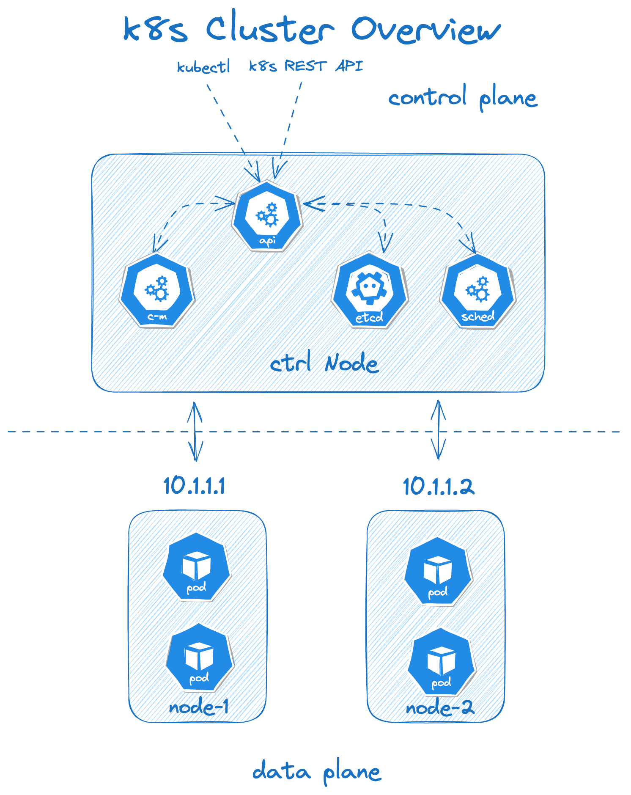
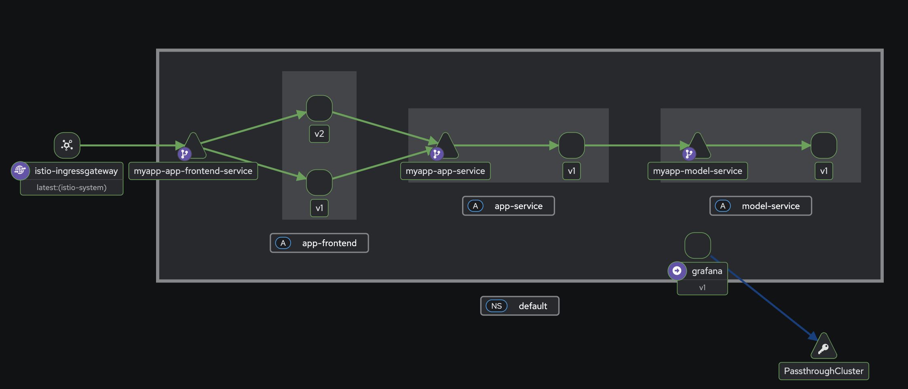

# Deployment overview

This document outlines the deployment structure and request flow of our
application. It is designed to help new contributors understand the overall
architecture, the services involved, and how traffic is managed and observed
using Istio.

## Cluster Setup Overview

Our current Kubernetes cluster consists of one controller VM (forming the control
plane) and two worker node VMs (forming the data plane). The environment is
provisioned using Vagrant and Ansible for local infrastructure automation.

> These nodes are configured and provisioned in `provisioning/` folder and can be easily scaled up by updating
> the variables provided in the Vagrantfile

- The controller node runs core Kubernetes control plane components

- The worker nodes host all application and monitoring workloads, including our
  microservices (`app-frontend`, `app-service`, `model-service`) and observability
  tools (`grafana`, `prometheus`, `kiali`).

Each Pod deployed to the worker nodes has an Istio sidecar proxy
([Envoy](https://istio.io/latest/docs/ops/deployment/architecture/#envoy))
automatically injected. These sidecars form the service mesh data plane,
enabling secure and observable communication between services.

All nodes are connected via the Kubernetes cluster network, enabling seamless
pod-to-pod and service-to-service communication across the cluster.

# Deployment architecture

Our deployment is organized as a Helm chart and includes several templates for the
microservices,monitoring components, and service mesh infrastructure. All components are
deployed to a Kubernetes cluster and interact over a service mesh provided by
Istio.

# Component Overview

| Component       | Description                                                            |
| --------------- | ---------------------------------------------------------------------- |
| `app-frontend`  | The frontend UI exposed via Istio Gateway                              |
| `app-service`   | A backend microservice for communication between app and model-service |
| `model-service` | A model-serving component that handles ML inference                    |
| `grafana`       | Metrics dashboard, exposed via a separate ingress                      |
| `prometheus`    | Metrics collection, integrated with Istio and Grafana                  |
| `istio`         | Manages traffic routing and mesh policy                                |
| `kiali`         | Istio observability dashboard, exposed via Istio Gateway               |
| `k8s dashboard` | General cluster dashboard, exposed via a separate ingress              |

# Architecture Visualization

The application consists of three core services: `app-frontend`, `app-service`, and
`model-service`, each deployed as a Kubernetes Deployment with an injected Istio
sidecar. Traffic flows from the internet through the Istio Ingress Gateway to
`app-frontend`, which dynamically routes requests between versioned deployments
using a `VirtualService` and `DestinationRule`. The frontend communicates
internally with `app-service`, which in turn calls `model-service`. Monitoring and
observability components such as Prometheus, Grafana, and Kiali are deployed in
parallel but operate outside the main request path.

# Traffic Flow & Runtime Architecture

## 1. Ingress and Entry into the Mesh

External requests enter the system via the `istio-ingressgateway`, a component
of the Istio control plane running in the `istio-system` namespace. It acts as
the entry point into the service mesh.

The gateway is configured [here](../helm/myapp-chart/templates/istio/gateway.yml).

Traffic is routed based on Istio `VirtualServices`. Specifically:

Requests to the frontend application are routed to the service frontend-service
based on host/path rules defined in
[istio/virtualservices.yml](../helm/myapp-chart/templates/istio/virtualservices.yml)

## 2. Frontend Application (app-frontend)

`app-frontend-service` is a Kubernetes Service abstracting over two active deployments of the same application:

- `app-frontend:v1`
- `app-frontend:v2`

Istio's sidecar injection ([Envoy
proxies](https://istio.io/latest/docs/ops/deployment/architecture/#envoy)) is
enabled here, which allows traffic routing to be dynamically managed using the
following:

- **VirtualService**: manages how traffic is split between `v1` and `v2`.
- **DestinationRule**: defines subsets (`v1`, `v2`) and their associated
  policies. Configuration can be found in [istio/destinationrules.yml](../helm/myapp-chart/templates/istio/destinationrules.yml).

Each version (v1 and v2) runs in its own pod, and each pod contains:

- The application container
- An automatically injected Envoy sidecar (by Istio)

###### Deployment Manifest: [templates/app-frontend/deployment.yml](../helm/myapp-chart/templates/app-frontend/deployment.yml)

###### Service Manifest: [templates/app-frontend/deployment.yml](../helm/myapp-chart/templates/app-frontend/service.yml)

## 3. Backend Application (app-service)

The frontend makes internal calls to `app-service`, a Kubernetes Service that maps to:

- `app-service:v1` deployment.

This pod also includes:

- Application container
- Envoy sidecar for mesh traffic management and observability

The routing here is relatively simple since we only have one version in deployment, but still uses a
VirtualService and DestinationRule for consistency and telemetry.

###### Deployment Manifest: [templates/app-service/deployment.yml](../helm/myapp-chart/templates/app-service/deployment.yml)

###### Service Manifest: [templates/app-service/deployment.yml](../helm/myapp-chart/templates/app-service/service.yml)

## 4. Model Service (model-service)

`app-service` communicates with `model-service`, which maps to:

- `model-service:v1` deployment.

Again, the pod runs with a sidecar proxy and is part of the Istio service mesh.

###### Deployment Manifest: [templates/model-service/deployment.yml](../helm/myapp-chart/templates/model-service/deployment.yml)

###### Service Manifest: [templates/model-service/deployment.yml](../helm/myapp-chart/templates/model-service/service.yml)

## 5. Grafana and Passthrough Traffic

`grafana` is deployed as a monitoring tool but is not routed via the Istio
ingress gateway. Instead, it communicates directly with external services using
a `PassthroughCluster`, bypassing Istio's traffic management rules.

Its pod does not handle mesh traffic routing and is accessed through a separate
ingress controller, not defined in Istio manifests.

# Dynamic Routing

Istio enables dynamic traffic routing between multiple versions of the same
service via
[VirtualService](https://istio.io/latest/docs/reference/config/networking/virtual-service/)
and
[DestinationRule](https://istio.io/latest/docs/reference/config/networking/destination-rule/)
resources. This setup allows us to control the percentage of traffic routed to
each version without modifying service definitions or restarting deployments.

In our deployment, dynamic routing is primarily applied to the `app-frontend`
component, where we maintain two concurrent versions:

- `app-frontend:v1` – the baseline version of the frontend
- `app-frontend:v2` – an alternate version served for comparison

The routing behavior is defined in the `VirtualService` associated with
app-frontend-service. Istio uses [subset-based
routing](https://istio.io/latest/docs/reference/config/networking/destination-rule/#Subset),
with each subset corresponding to a specific version (defined via pod labels in
the DestinationRule).

### Weighted Traffic Split

The `VirtualService` for `app-frontend-service` performs a weighted split between the two versions:

- 60% of incoming requests are routed to `v1`

- 40% of incoming requests are routed to `v2`

This logic is applied dynamically by Istio sidecar proxies (Envoy) at runtime,
allowing real-time control over traffic distribution. These weights can be
adjusted on-the-fly to gradually shift traffic toward a newer version or to
perform controlled rollbacks.

### How It Works in the Mesh

1. Requests reach the istio-ingressgateway and are routed based on VirtualService host/path rules.
2. The frontend VirtualService matches the request and evaluates the weighted split.
3. Based on the defined weights, traffic is routed to either the v1 or v2 Pod.
4. Each Pod includes an Istio sidecar, which intercepts traffic and forwards it to the application container.
