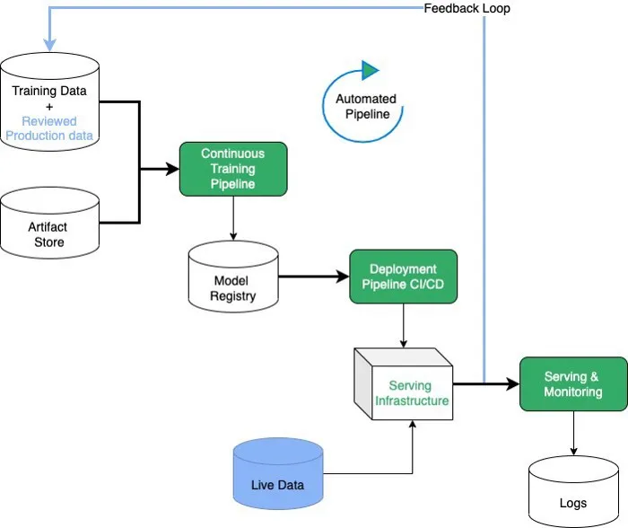

# Extension Proposal: Automated Model Re-training Based on User Feedback

> **Goal**  
> Replace today’s “train-once, deploy-forever” model with a **closed feedback loop** that turns daily user corrections into better models—safely, automatically, and on repeat. 

---

## 1 Why We Need This Change

Static training makes the model susceptible to performance degradation as real-world data evolves. One of the culprits may be data drift, where the statistical characteristics of input data change over time—often due to shifts in user behaviour or seasonal trends [[1]](https://rihab-feki.medium.com/mlops-02-7-things-you-need-to-learn-about-continuous-training-continuous-deployment-f3ec31d969e3). Similarly, concept drift is a frequent challenge, occurring when the relationship between input features and the target variable gradually shifts, invalidating prior assumptions [[2]](https://proceedings.mlsys.org/paper_files/paper/2022/hash/069a002768bcb31509d4901961f23b3c-Abstract.html). As outlined in the table below, the absence of a closed feedback loop and automated monitoring results in missed opportunities to leverage user corrections (feedback on whether the sentiment prediction by the model was correct) and production data. Model failures or degradation may go unnoticed until they become critical. 

| Observed Shortcoming | Negative Effect in Production | Mitigation in This Proposal |
|----------------------|--------------------------------|-----------------------------|
| **Static model** trained only on the initial dump | Accuracy drifts as language and topics change | Continuous user feedback ingestion + scheduled re-training |
| **Unused 👍/👎 feedback** | We lose ~ X high-quality labels per day | Store every vote, validate, add to training set |
| **Manual DVC trigger** | Slow, error-prone and costly interventions | One-click or cron-based Kubeflow pipeline |
| **No performance guardrails** | Risk of shipping worse models | Automated tests, drift checks, and canary release |

---

## 2 Solution Overview

The proposed extension introduces an automated feedback-driven learning loop that continuously improves model performance by integrating user feedback into the training and deployment pipeline with the following key components:

*Figure 1 — Data flows from the user back to the model [[3]](https://rihab-feki.medium.com/mlops-02-7-things-you-need-to-learn-about-continuous-training-continuous-deployment-f3ec31d969e3)*

1. **Feedback Ingestion** – The frontend emits a *feedback* event for every prediction. We stream these events through Apache Kafka, run schema checks, and store them in `postgres://feedback`.
2. **Data Curation** – A lightweight service scores, deduplicates, and tags new samples for re-training.
3. **Automated Re-training** – A Kubeflow pipeline (`/mlops/retraining/retrain-pipeline.yaml`) retrains the model nightly or on drift alerts from `drift_detector.py`.
4. **Validation & Safety Gates** – Unit tests, held-out metrics, and drift statistics must all beat the current production model before promotion.
5. **Progressive Delivery** – Istio DestinationRules expose the new image as a 10 % canary; Sticky Sessions ensure consistent user experience.
6. **Monitoring** – Grafana panels track accuracy, drift, deployment success, and feedback volume.

---

## 3 Portability & Broader Use

The retraining loop extension is designed to generalize well across other domains that collect user feedback. Below is an explanation of how each component can adapt across use cases, with examples from e-commerce ratings, and support ticket systems:

| Component | Restaurant Reviews (today) | E-commerce Ratings | Support Tickets |
|-----------|----------------------------|--------------------|-----------------|
| Event schema | `review_id`, `text`, `👍/👎` | `order_id`, `stars` | `ticket_id`, `resolution_yes/no` |
| Feature store/extractor | TF-IDF + fastText | Product metadata | BERT embeddings |
| Model head | Sentiment classifier | Rating predictor | Intent classifier |

The event schema is the type and format of feedback data collected from users. In restaurant reviews, this concerns whether the user agreed with the model's sentiment prediction (👍/👎). In e-commerce, it's typically a star rating associated with an order and product. In support systems, it's often binary (resolved_yes/no) and tied to a customer ticket ID. 

The feature store/extractor defines how input data is turned into machine-readable features. For restaurant reviews, we use TF-IDF and fastText. In e-commerce, one could rely on structured metadata (e.g., product name, price, and category). In support tickets, semantic meaning can be extracted using BERT embeddings of ticket text.

Despite different use cases, only the schema and model-specific logic (training script) need to change. Kafka topics, Kubeflow pipeline orchestration, and Istio rollout mechanism stay unchanged. As such, any application with user feedback can adopt the proposed pattern.

---

## 4 Experiment Plan

To evaluate the extension proposal, we propose to conduct a 90-day controlled A/B test summarized in the table below. The test compares the current static model (v1) with the proposed continuously-retrained model (v2). The goal is to assess whether continuous learning leads to measurable improvements in model accuracy, user engagement, operational efficiency, and deployment stability.

| Parameter | Control | Treatment |
|-----------|---------|-----------|
| Model | Current static (v1) | Continuous-learning (v2) |
| Traffic share | 50 % | 50 % |
| Duration | 90 days |
| KPIs | Accuracy on feedback labels, feedback rate, manual interventions, deployment failures |
| Success | +10 % accuracy, +15 % feedback, −50 % manual work, ≤1 % failures (p < 0.05) |

In the test setup, one group of users will interact with the baseline static pipeline (v1), while the second group will interact with the new continuously-learning pipeline (v2). Traffic will be evenly distributed—50% to each group to reduce selection bias. Running the experiment over a 90-day period ensures sufficient time for the retraining pipeline to activate multiple times and for statistically significant trends to emerge.

To quantify performance improvements, we will start by measuring accuracy on feedback-labelled data. This involves logging each instance of user feedback (such as 👍 or 👎) alongside the model’s prediction and calculating the percentage of times the model's prediction aligns with the user response (accuracy). To provide a more nuanced evaluation, especially when class distributions are imbalanced, we can also compute precision, recall, and F1 score metrics. Precision captures how many positive predictions were actually correct, recall measures how many actual positives were retrieved, and F1 balances the two.

It is important to note that these metrics assume that user feedback is a reliable ground truth, which may not always be the case due to missclicks or misunderstandings. We account for this by aggregating results over many sessions and filtering feedback that fails schema validation or appears inconsistent.

In addition to model performance, we will track feedback rate as a proxy for user engagement, defined as the number of feedback events submitted per 1,000 user sessions or requests. This helps us understand if users are more willing to interact with v2. From the developer's perspective, a key metric is the number of manual interventions required. We will log manual retraining triggers, rollbacks, or hotfixes using Git history, pipeline logs, or dashboard annotations to determine if v2 reduces human workload. Lastly, deployment stability will be monitored by counting failures (e.g. Prometheus alerts, or rollback events triggered during automated rollout processes). 

Progress of the experiment will be visible in the Grafana dashboard (`grafana-dashboard-continuous.json`). When a canary deployment starts (10% of traffic routed to a new version) or stops (100% traffic or rollback), these events will be annotated. Similarly, re-train events (e.g. due to drift, schedule, or manual trigger) will be annotated so we can correlate events with observed outcomes. Collecting such data can lead to insights on:
 - Did error rates drop after the retrain?
 - Did the canary model cause latency spikes?
 - Was data drift (measured with metrics) corrected following model update?

For each measured metric, a falsifiable hypothesis can be formulated of the form: 

**Null hypothesis:** There is no statistically significant difference in **...insert metric...** between **V1** and **V2**.

If statistical significance is observed across key metrics, for example an improved accuracy, increased user engagement, and reduced manual interventions in V2, such findings would support permanent adoption of the retraining loop. Additionally, analyzing post-experiment logs (such as the timing and frequency of drift or retrain events) may offer deeper insights into how v2 reacts to real-world shifts. These insights could inform further refinements - for example help us decide whether retraining should remain automated or be scheduled at fixed intervals to balance performance with compute cost.

---

## 5 Implementation Artefacts

The following table lists the core implementation artefacts that together enable the proposed continuous re-training loop. These components work in coordination: user feedback is collected and validated, triggering the `retrain-pipeline.yaml` workflow in Kubeflow. The `drift_detector.py` monitors input distributions and emits Prometheus metrics to signal when retraining is needed. Once a new model passes validation, it is deployed using Istio configuration defined in `continuous-canary.yaml`, allowing progressive rollout via Sticky Sessions. The entire process is visualized using the Grafana dashboard and an architecture diagram to support observability and reproducibility.

| File / Resource | Purpose |
|-----------------|---------|
| `mlops/retraining/retrain-pipeline.yaml` | Defines the Kubeflow workflow (ingest → train → test → register) |
| `mlops/drift_detector.py` | Statistical drift monitor publishing Prometheus metrics |
| `helm/istio/continuous-canary.yaml` | Gateway, VirtualService, DestinationRule with 90/10 split & Sticky Sessions |
| `docs/images/continuous-learning-architecture.png` | Architecture diagram used above |
| `grafana/grafana-dashboard-continuous.json` | Importable dashboard |

---

## 6 Related Work

### Academic References

[1] **Matchmaker: Data Drift Mitigation in Machine Learning for Large-Scale Systems**  
Ankur Mallick, Kevin Hsieh, Behnaz Arzani, Gauri Joshi (2022).  
*Proceedings of Machine Learning and Systems, Vol. 4, pp. 77–94.*  
[Link](https://proceedings.mlsys.org/paper_files/paper/2022/hash/069a002768bcb31509d4901961f23b3c-Abstract.html)

[2] **A Systematic Review on Detection and Adaptation of Concept Drift in Streaming Data Using Machine Learning Techniques**  
*Shruti Arora, Rinkle Rani, Nitin Saxena (2024). Wiley Interdisciplinary Reviews: Data Mining and Knowledge Discovery, 14(4), e1536.*  
[Link](https://onlinelibrary.wiley.com/doi/10.1002/widm.1536)

### Industry Examples
| # | Project | Key Take-aways | Link |
|---|---------|---------------|------|
| 3 | **Continuous Training & Deployment in MLOps** | Shows how automation, monitoring, and feedback loops form the backbone of robust ML lifecycles. | [Medium](https://rihab-feki.medium.com/mlops-02-7-things-you-need-to-learn-about-continuous-training-continuous-deployment-f3ec31d969e3) |
| 4 | **Google TFX (TensorFlow Extended)** | Demonstrates a production pipeline that performs continuous training, validation, and safe rollout. | [Google AI Blog](https://dl.acm.org/doi/abs/10.1145/3097983.3098021) |
| 5 | **Uber Michelangelo** | Describes an end-to-end platform with real-time feature serving and automatic model updates. | [Uber Engineering](https://eng.uber.com/michelangelo-machine-learning-platform/) |

### Open-Source Tools & Frameworks
| # | Tool | Why We Care | Link |
|---|------|-------------|------|
| 6 | **MLflow** | Provides experiment tracking and a model registry—ideal for storing and promoting re-trained models. | [Documentation](https://mlflow.org/docs/latest/index.html) |
| 7 | **Kubeflow** | Orchestrates Kubernetes-native pipelines; we use it for scheduled re-training and validation. | [Docs](https://www.kubeflow.org/docs/) |
| 8 | **Apache Kafka** | Enables real-time ingestion of user feedback and event-driven processing for our pipeline triggers. | [Streams Docs](https://kafka.apache.org/documentation/streams/) |

---

## 7 Conclusion

By closing the feedback loop we:

* **Stop accuracy drift** and learn from every new review.
* **Save engineering time** through hands-off re-training and deployment.
* **Create a reusable template** for any domain that collects user feedback.

This extension directly removes our biggest release-engineering pain point and positions the project for long-term, data-driven improvement.
